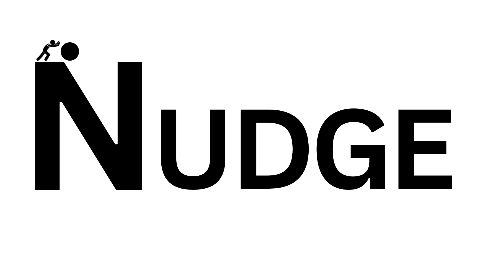

<p align="center">
  
</p>

<p align="center">
  <a href="https://pypi.org/project/nudge-bio/"></a>
  <a href="https://pypi.org/project/nudge-bio/"></a>
  <a href="https://github.com/NicholasEhsanRoy/NUDGE/blob/main/LICENSE"></a>
  <a href="https://github.com/NicholasEhsanRoy/NUDGE/actions/workflows/ci.yml"></a>
</p>

<p align="center">
  <a href="https://www.python.org/"></a>
  <a href="https://modelcontextprotocol.io/"></a>
  <a href="https://claude.ai/"></a>
</p>

<p align="center">
  <b>Mechanism attribution for perturbation screens — threshold vs gain vs ceiling, and it abstains when it can't tell.</b>
</p>

---

## What is NUDGE

**N**ode/edge **U**ltrasensitivity **D**iagnostic for **G**ene-regulatory **E**ffects.

NUDGE fits a compositional, differentiable **circuit** model to single-cell perturbation
(Perturb-seq) data and classifies each perturbation by *mechanism* — does a knockdown move a
switch's **threshold** (`K`), change its **gain** (`n`), or shift its **ceiling** (`v_max`)? —
a distinction the field's default linear models cannot make. Its defining property is
**honesty: when the data can't identify the mechanism, NUDGE abstains** (`unresolved` /
`off-model`) rather than emit a confident guess. It can then invert a *reliable* fit to
propose an untested intervention, behind safety gates. Built on
[MADDENING](https://github.com/Microrobotics-Simulation-Framework/MADDENING), a differentiable
JAX graph-physics engine.

Gene-regulatory circuits are what NUDGE was **first built for** and named for — but the core
is domain-general (a compositional, differentiable ODE model plus a calibrated abstention
gate). It already reaches beyond gene circuits to microbial community dynamics, protein
aggregation kinetics, and differentiable experimental design (see the capability map below).

> Originated at the **Built with Claude: Life Sciences** hackathon (July 2026) and is itself
> an experiment in Claude-assisted development — the git history is written to make that
> auditable. For a guided, judges-facing tour of the whole project, read
> **[`JUDGES_GUIDE.md`](https://github.com/NicholasEhsanRoy/NUDGE/blob/main/JUDGES_GUIDE.md)**.

## Install

```bash
pip install nudge-bio
```

Core install pulls `maddening[ift]>=0.3.1`, `jax==0.5.1` (pinned), `numpy`, `optax`,
`pydantic`, `anndata`, `typer`, `pyyaml`. **Python ≥ 3.10.**

Optional extras:

| Extra | `pip install "nudge-bio[…]"` | What it adds |
|---|---|---|
| `bio` | real-data loaders | `scanpy` / `pertpy` for Tier-1/2 Perturb-seq loading + E-distance |
| `viz` | honest figures | `matplotlib` — the opt-in `nudge.viz` figure battery (core stays matplotlib-free) |
| `mcp` | Claude server | the `mcp` SDK for the `nudge-mcp` Model Context Protocol server |

For local development: `uv venv && uv pip install -e ".[dev]"`.

## Quickstart

### Attribute a mechanism from a dose-response curve

The flagship positive: give NUDGE a knockdown dose-response of a readout signature and it
calls **switch vs graded** (or abstains). Here a genuinely ultrasensitive curve resolves to
`switch`:

```python
import numpy as np
from nudge.mechanisms.regulatory import hill_repression
from nudge.inference.dose_response import fit_dose_response, classify_dose_response

# A knockdown dose-response of a self-renewal signature (an ultrasensitive switch, n=6).
dose = np.linspace(0.0, 1.0, 22)
response = 0.2 + np.asarray(hill_repression(dose, 0.5, 6.0, 0.8))
response += np.random.default_rng(0).normal(0.0, 0.02, dose.shape)  # measurement noise

fit = fit_dose_response(dose, response, direction="repress", n_boot=200)
call, reason = classify_dose_response(fit)
print(f"call = {call!r}")
print(f"apparent gain n = {fit.n:.1f}  (95% CI {fit.ci_n[0]:.1f}-{fit.ci_n[1]:.1f})   "
      f"K = {fit.k_threshold:.2f}   R2 = {fit.r2:.2f}")
```

```text
call = 'switch'
apparent gain n = 6.5  (95% CI 6.0-7.5)   K = 0.49   R2 = 1.00
```

(`n` is an *apparent population gain*, not molecular cooperativity — NUDGE says so in the
`reason` string.) A curve whose doses don't span the inflection, or whose gain CI straddles
the ultrasensitive line, returns `unresolved` / `no-effect` instead.

### The two verbs — `fit` and `design`

```python
import nudge
result = nudge.fit(adata, circuit)     # → MechanismMap (per-perturbation calls + uncertainty)
plan   = nudge.design(target)          # → ranked interventions, behind safety gates
```

`fit` wants **raw integer counts** — NUDGE owns the observation model (a negative-binomial +
dropout count model; the mechanism signal lives in the *shape* of the single-cell
distribution, which standard log/normalize pipelines destroy). Pass an `AnnData` of raw
counts with `obs["condition"]` labels (a `"WT"` control plus one label per perturbation). See
the data contract in
[`docs/user_guide/data_contract.md`](https://github.com/NicholasEhsanRoy/NUDGE/blob/main/docs/user_guide/data_contract.md).

**Honesty, by design:** a *single* under-powered snapshot at *one* operating point genuinely
tends to abstain — the gain⇄threshold degeneracy is real, and forcing a call would be
guessing. That is why the resolving capabilities read a **dose axis** (above), **several
reporters** of one latent (`multi_reporter`), or **two operating points**. On a single
synthetic snapshot, `nudge.fit` honestly abstains:

```python
import nudge
from nudge.circuits import ras_switch_1node
from nudge.data.synthetic import PerturbationSpec

circuit = ras_switch_1node()
adata = nudge.generate_synthetic_perturbseq(
    circuit,
    perturbations=[PerturbationSpec("KD", scope="edge", index=0, param="K", factor=3.0)],
    n_cells_per_condition=1000, seed=0,
)
result = nudge.fit(adata, circuit)     # one operating point; raw counts checked at the boundary
for c in result.calls:
    print(c.perturbation, "->", c.mechanism.value, f"(confidence {c.confidence:.2f})")
```

```text
KD -> no-effect  (confidence 0.00)
```

That abstention is the tool working, not failing — NUDGE won't over-call a single snapshot.

### Command line

```bash
nudge check-data screen.h5ad                 # raw-count guardrail — fails loudly on normalized input
nudge load screen.h5ad                        # conditions / cells / genes summary
nudge attribute screen.h5ad --target SOS1    # mechanism call + honest abstentions/skips
nudge explain unresolved                     # why an abstention was the honest answer
nudge mechanisms                             # the registered mechanism library + cards
```

Run `nudge --help` for the full verb list.

## What it does — the capability map

Each capability is fail-safe by construction (0% misclassification on its synthetic battery)
and ships a Mechanism Card, tests, and a decoy it must correctly resist. For the narrated
version of any row — the reasoning, the honesty crux, and the real-data result — see
[`JUDGES_GUIDE.md`](https://github.com/NicholasEhsanRoy/NUDGE/blob/main/JUDGES_GUIDE.md) and
the [notebooks index](https://github.com/NicholasEhsanRoy/NUDGE/blob/main/notebooks/README.md).

| Capability | ID | One line |
|---|---|---|
| Dose-response attribution | `NUDGE-METHOD-001` | switch vs graded from a dose axis, or abstain |
| Cross-modality readout | `NUDGE-METHOD-002` | same K/n/v_max attribution on a continuous channel (fluorescence/activity) |
| Synergy / epistasis | `NUDGE-METHOD-003` | additive vs synergistic/buffering for a two-perturbation combo |
| Robustness dial | `NUDGE-METHOD-006` | 0..1 proximity of a bistable switch to losing bistability (one-sided near the fold) |
| Inverse design — `design()` | `NUDGE-METHOD-007` | invert a reliable fit to propose an intervention, behind a bifurcation safety gate |
| Multi-reporter joint fit | `NUDGE-METHOD-008` | several reporters of one latent switch break the K⇄v_max degeneracy |
| Hidden-node abstention | `NUDGE-METHOD-009` | turn a bare `off-model` verdict into a legible differential (never asserts a hidden node) |
| Differential attribution | `NUDGE-METHOD-010` | which knob differs for the SAME perturbation across two contexts |
| Constitutive-reporter control | `NUDGE-METHOD-011` | separate circuit ultrasensitivity from a nonlinear readout (the `NUDGE-LIM-006` fix) |
| Temporal / Lotka–Volterra | `NUDGE-METHOD-012` | trajectory-fit attribution for a microbial community (growth/interaction/susceptibility) |
| Fibrillization kinetics | `NUDGE-METHOD-013` | amyloid aggregation curve → identifiable composites + a measured gauge degeneracy |
| Optimal experimental design | `NUDGE-METHOD-014` | gradient-optimize *when to measure* to resolve a sloppy parameter |
| Honest figures — `nudge.viz` | (opt-in `[viz]`) | render any frozen result to a figure; abstentions draw as abstentions |

## Drive it from Claude (MCP)

NUDGE ships a custom MCP server so Claude can run the whole modelling surface in plain
language:

```bash
uv pip install -e ".[mcp]"
claude mcp add --scope project nudge -- uv run nudge-mcp   # Claude Code
```

The same stdio server registers as a **Local command** connector in Claude Desktop and the
**Claude Science** workbench. A step-by-step walkthrough (connect + an α-synuclein /
Parkinson's aggregation-kinetics case) is in
[`docs/user_guide/claude_science.md`](https://github.com/NicholasEhsanRoy/NUDGE/blob/main/docs/user_guide/claude_science.md);
verified connection recipes are in
[`design/INTEGRATION_FEASIBILITY.md`](https://github.com/NicholasEhsanRoy/NUDGE/blob/main/design/INTEGRATION_FEASIBILITY.md).

## The honesty differentiator

NUDGE's whole thesis is *never claim more than you measured*. A **confident-wrong** call — a
specific mechanism where the truth is "can't tell" — is the only hard failure; an abstention
or a one-sided bound is a feature, not a bug. The fail-safe property is **measured** (0%
misclassification across the synthetic battery) and **adversarially red-teamed** across many
rounds: dedicated passes try to force any capability into a confident, specific, wrong call
past its abstention gates, and every found hole is independently reproduced, then closed or
locked as a regression decoy. A found hole is a *win* — the red-team loop is ongoing, not a
one-time stamp. The auditable red-team → fix → independent-audit trail lives in
[`design/hardening/LEDGER.md`](https://github.com/NicholasEhsanRoy/NUDGE/blob/main/design/hardening/LEDGER.md).

## Learn more

- **[`JUDGES_GUIDE.md`](https://github.com/NicholasEhsanRoy/NUDGE/blob/main/JUDGES_GUIDE.md)** — the guided, judges-facing tour of the whole project.
- **[Notebooks index](https://github.com/NicholasEhsanRoy/NUDGE/blob/main/notebooks/README.md)** — the guided, output-embedded walkthroughs (the [dose-response flagship](https://github.com/NicholasEhsanRoy/NUDGE/blob/main/notebooks/OCT4_NANOG_Flagship.ipynb), [inverse design](https://github.com/NicholasEhsanRoy/NUDGE/blob/main/notebooks/Inverse_Design.ipynb), and more).
- **[`design/STATE.md`](https://github.com/NicholasEhsanRoy/NUDGE/blob/main/design/STATE.md)** — the live roadmap, architecture decisions, and gotchas (start-here doc for contributors).
- **[`scripts/vv/FINDINGS.md`](https://github.com/NicholasEhsanRoy/NUDGE/blob/main/scripts/vv/FINDINGS.md)** — the measured V&V + calibration results.
- Plain-language pitch: [`design/PITCH.md`](https://github.com/NicholasEhsanRoy/NUDGE/blob/main/design/PITCH.md); full PR/FAQ: [`design/WORKING_BACKWARDS.md`](https://github.com/NicholasEhsanRoy/NUDGE/blob/main/design/WORKING_BACKWARDS.md).

## Capabilities NOT provided

Scope discipline, stated up front:

- **Not** a general Perturb-seq hit-caller — it answers a sharper question than "is this gene a hit?"
- **Not** a black-box response predictor — the deliverable is the *mechanism*, not just the number.
- **Not** a substitute for a wet-lab screen — it tells you which experiment is worth running next.
- **Not** a clinical, diagnostic, or medical-device tool; makes no clinical claims.

## License

MIT. See [LICENSE](https://github.com/NicholasEhsanRoy/NUDGE/blob/main/LICENSE).
